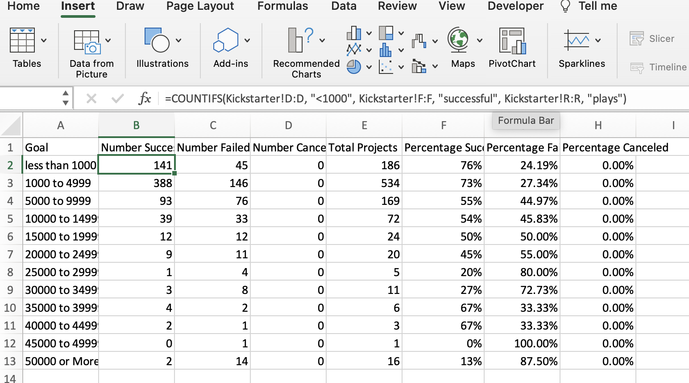

# Kickstarting with Excel

## Overview of Project
The overview of this analysis was to help Louise, a playwright to analyze which factors will lead to a successful fundraising campaign. 
 
 ### Purpose
The purpose specifically for deliverable one our analysis included theater fundraising outcomes(successful, failed, canceled) based on the launch date of the campaign. Deliverable two analyzed the percent outcomes of the subcategory "plays" based on the goal set for the fundraising campaign. 
 
 ## Analysis and Challenges 

### Analysis of Outcomes Based on Launch Date

#### Year Column 
I preformed this analysis  by first producing a new column in the excel worksheet called "Date Created Conversion". The purpose of this column was to convert the Unix timestamps into a readable format. I then created a new column called "Year" to extract the year from "Date Created Conversion". I did this by using the function "Year()". In the parenthesis I include the cell number, for this example here it's "(S522)". I then clicked on the black small cross on the bottom right corner which instantly applied the formula to the entire column.  
 
   
 
#### Pivot Table  
 
 The next step was to create a pivot table. I extracted the months out of the year and then created a pivot table including the months, outcomes of the fundraiser, filtering for years and theater.  
  
   
 
 #### Line Graph  
  
 To visualize the relationship of theater outcomes based on Launch date I created a line graph. With the pivot table worksheet open, click on PivotChart analyze on the ribbon and then select PivotChart. I then selected Design and changed the graph to a stacked marked line graph. 
  
    
        
### Analysis of Outcomes Based on Goals 
   
   #### Countifs
 In a new worksheet I created 8 cells named (Goal, Number Successful, Number Failed, Number Canceled, Total Projects, Percentage Successful, Percentage Failed, Percentage Canceled. In the "Goal" column I created 12 categories from <1000 to >50000 or more. Using the countifs function I was able to identify number successful, number failed and number canceled for the respective row. Included is an example of the calculation I used. An example of the function is fx=Countifs(worksheet column, "criteria", worksheet column, "critera"..etc). The three categories I included in the formula was outcome, goal amount, and subcategory of plays. Using the Sum function I added all three categories("Number successful", "Number Failed and Number Canceled") to achieve "Total Projects". To calculate the outcome percentages I used the respective outcomes columns and divided that cell by "Total Projects". 
  
   
 
 #### Line Graph 
 To display a visual representation of the data in excel I included a line graph. I did this by highlighting the columns "Goal", "Percentage Successful", "Percentage Failed" and "Percentage Canceled". I then clicked inset and then line graph.  
 

### Challenges and Difficulties Encountered 
 
 I did not have any challenges with the first deliverable. Possible challenges that one could encounter are not accurately extracting the year from the "Date Created Conversion" column. Other potential challenges are not filtering accurately in the pivot table created, or inaccurately assigning row and column variables as well as displaying any other type of graph than the stacked marked line graph. The second deliverable I had two issues. First, I was including an = sign in my countifs calculation for <1000. Secondly, I had a blank cell highlighted when I was making a graph resulting in an error for my line graph. 

## Results

### Conclusions on Outcomes based on Launch Date
 
 One conclusion I can draw about the Outcomes based on Launch Date is there waas a sharp increase in percent successful theater fundraising outcomes from april to may. Another conclusion is there was a steady decline in percent successful fundraising outcomes from april to september, although for those month percent outcomes were still higher than most other months. 

### Conclusion on Outcome based on Goals
Most successful campaigns were between <1000 and 24,999. There was a decline and then a outlier of 35,000 to roughly around 40,000.  

### Limitation on Dataset
 Limitations to this database is there's a lot of junk data that we had to filter through. No background on the donors so we know who is more likely to participate in the campaign.  
 
### Alternative Graphs/Tables 

 We could create a stack bar graph for Theater Outcomes by Launch Date. We could have used Box and Whiskers for Outcomes Based on Goals to look for outliers. 
