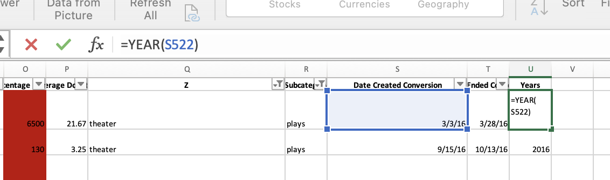
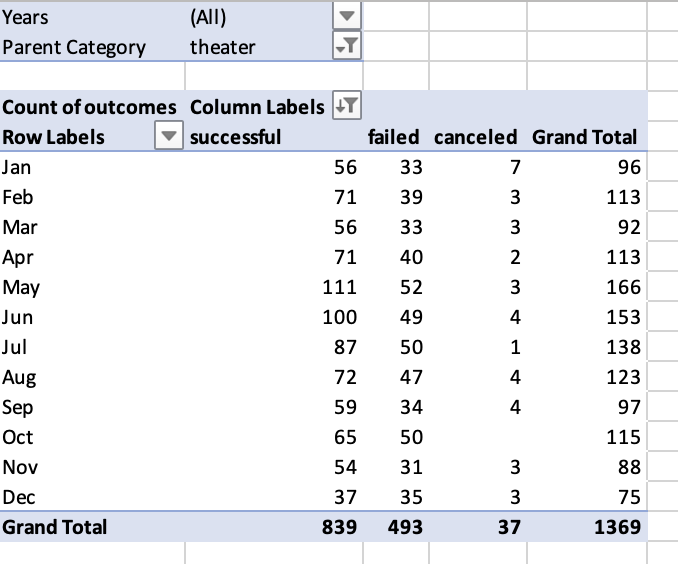
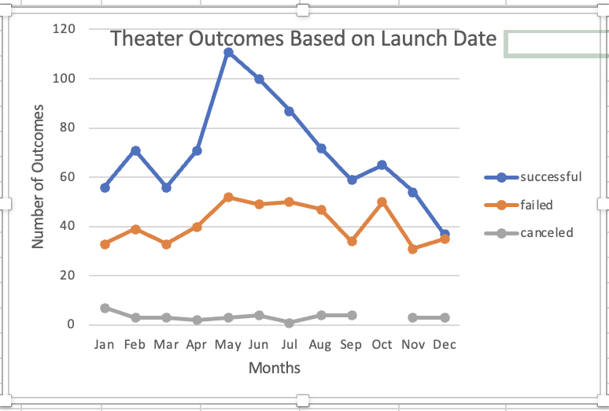

# Kickstarting with Excel

## Overview of Project
The overview of this analysis was to help Louise, a playwright analyze which factors will lead to a successful fundraising campaign. 
### Purpose
The purpose specifically for deliverable one our analysis included theater fundraising outcomes(successful,failed,canceled) based on the launch date of the campaign. Deliverable two analyzed the percent outcomes of the subcategory "plays" based on the goal set for the fundraising campaign. 
## Analysis and Challenges 

### Deliverable 1 

#### Year Column 
I preformed this analysis  by first producing a new column in the excel worksheet called "Date Created Conversion". The purpose of this column was to convert the Unix timestamps into a readable format. I then created a new column called "Year" to extract the year from "Date Created Conversion". I did this by using the function "Year()". In the parenthesis I include the cell number, for this example here it's "(S522)". I then clicked on the black small cross on the bottom right corner which instantly applied the formula to the entire column.  
   
 
#### Pivot Table  
 
 The next step was to create a pivot table. I extracted the months out of the year and then created a pivot table including the months, outcomes of the fundraiser, filtering for years and theater.  
   
 
 #### Line Graph  
  
 To visualize the relationship of theater outcomes based on Launch date I created a line graph. With the pivot table worksheet open, click on PivotChart analyze on the ribbon and then select PivotChart. I then selected Design and changed the graph to a stacked marked line graph. 
   
  
  #### Challenges 
  I did not have any challenges with this deliverable. Possible challenges that one could encounter are not accurately extracting the year from the "Date Created Conversion" column. Other potential challenges are not filtering accurately in the pivot table created, or inaccurately assigning row and column variables as well as displaying any other type of graph than the stacked marked line graph. 
### Analysis of Outcomes Based on Launch Date
        
### Analysis of Outcomes Based on Goals

### Challenges and Difficulties Encountered

## Results

- What are two conclusions you can draw about the Outcomes based on Launch Date?

- What can you conclude about the Outcomes based on Goals?

- What are some limitations of this dataset?

- What are some other possible tables and/or graphs that we could create?
