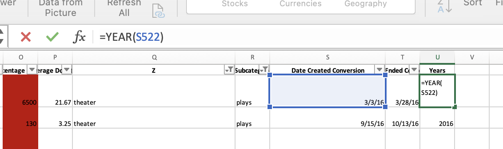

# Kickstarting with Excel

## Overview of Project
        The overview of this analysis was to help Louise, a playwright analyze which factors will lead to a successful fundraising campaign. 
### Purpose
        The purpose specifically for deliverable one our analysis included theater fundraising outcomes(successful,failed,canceled) based on the launch date of the campaign. Deliverable two analyzed the percent outcomes of the subcategory "plays" based on the goal set for the fundraising campaign. 
## Analysis and Challenges
        I preformed this analysis  by first producing a new column in the excel worksheet called "Date Created Conversion". The purpose of this column was to convert the Unix timestamps into a readable format. I then created a new column called "Year" to extract the year from "Date Created Conversion". I did this by using the function "Year()". In the parenthesis I include the cell number, for this example here it's "(S522)". I then clicked on the black small cross on the bottom right corner which instantly applied the formula to the entire column. I then created a pivot table 
       
### Analysis of Outcomes Based on Launch Date
        
### Analysis of Outcomes Based on Goals

### Challenges and Difficulties Encountered

## Results

- What are two conclusions you can draw about the Outcomes based on Launch Date?

- What can you conclude about the Outcomes based on Goals?

- What are some limitations of this dataset?

- What are some other possible tables and/or graphs that we could create?
